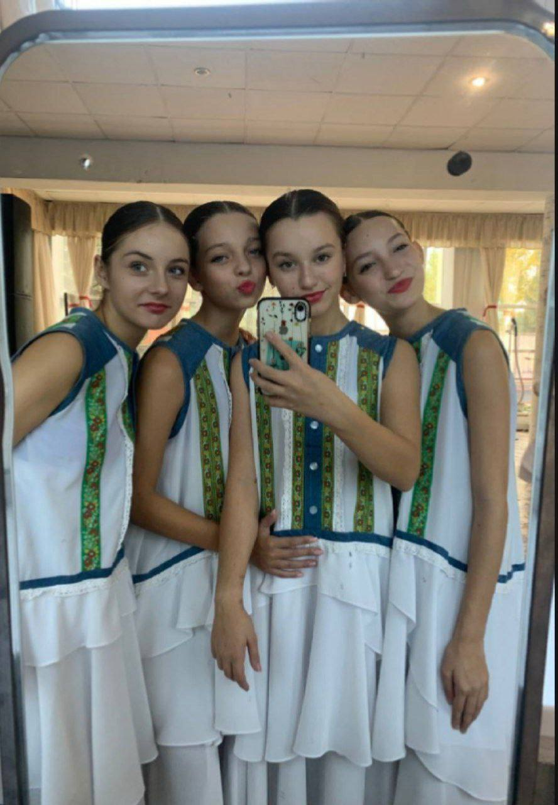
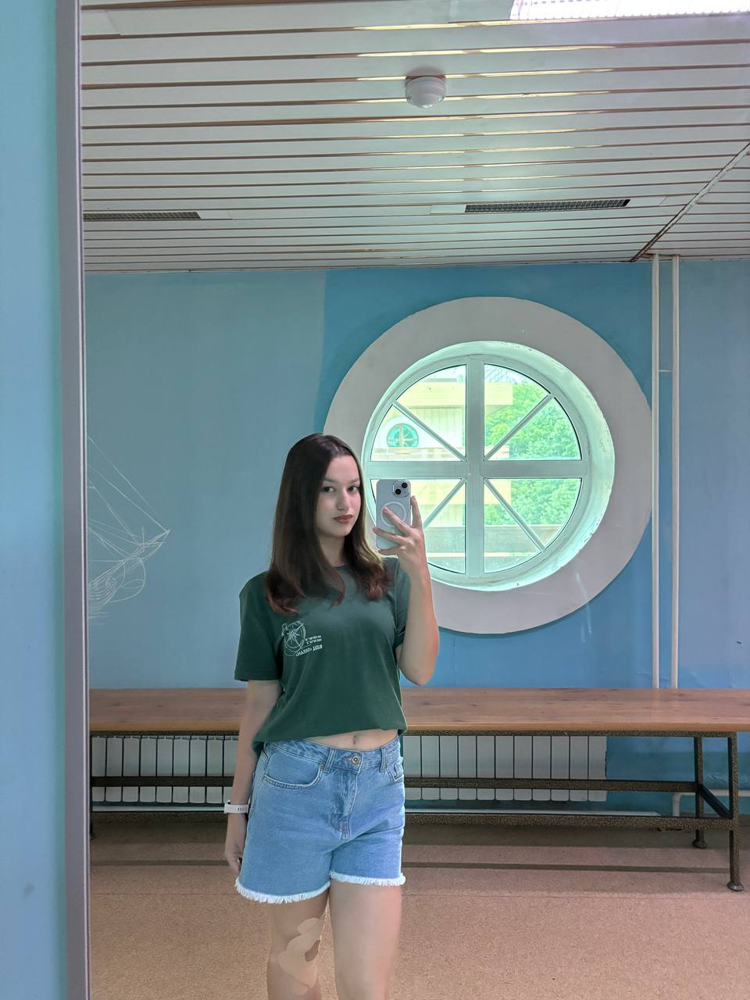
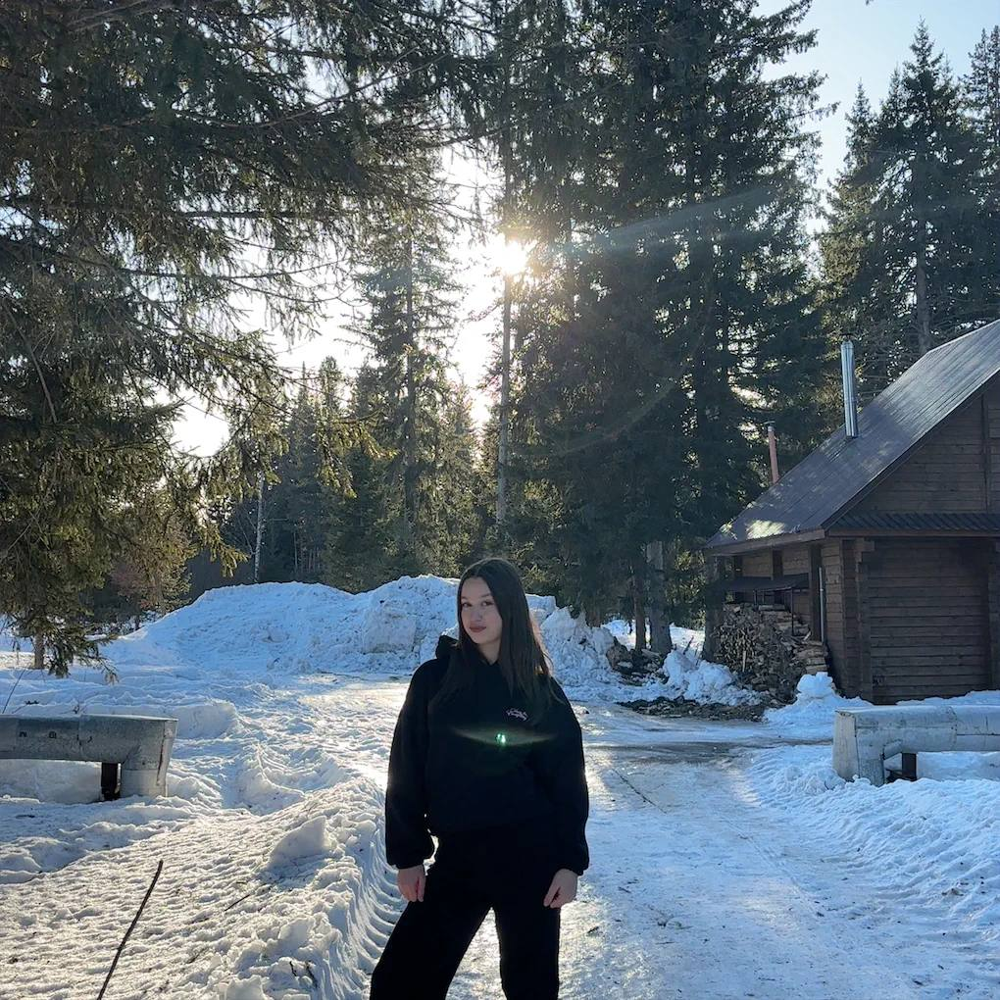
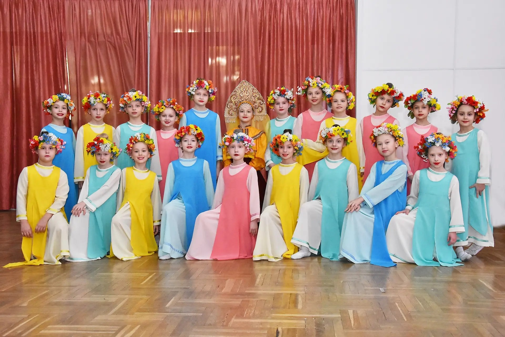
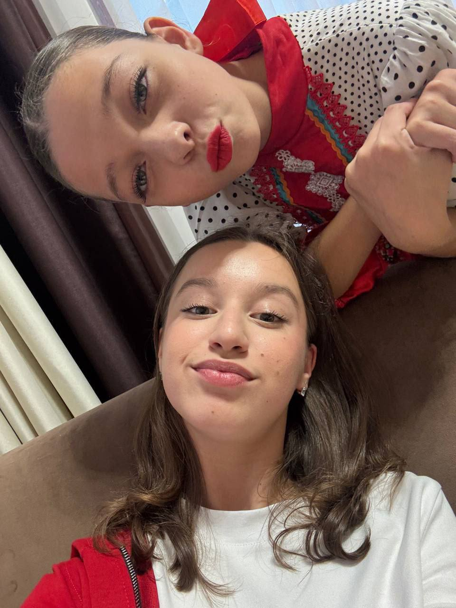
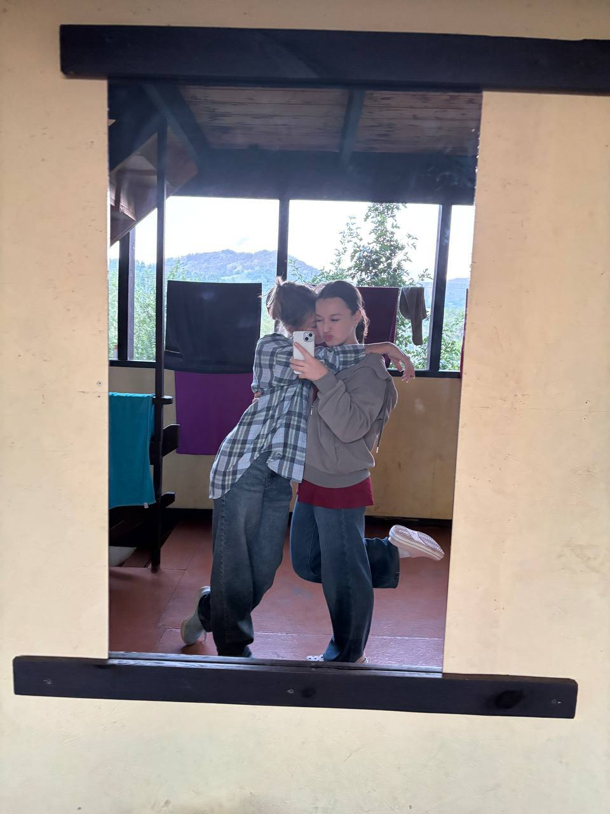
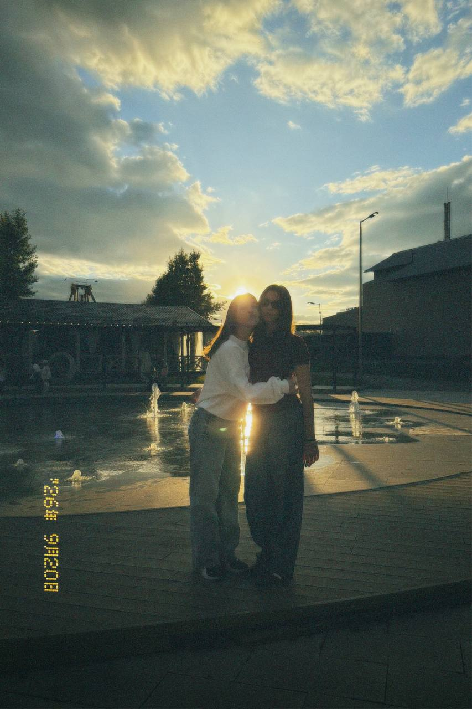

<!DOCTYPE html>
<html lang="ru">
<head>
  <meta charset="UTF-8">
  <meta name="viewport" content="width=device-width, initial-scale=1.0">

  <title>MARIA IZABELLA</title>

  <link rel="preconnect" href="https://fonts.googleapis.com">
  <link rel="preconnect" href="https://fonts.gstatic.com" crossorigin>
  <link href="https://fonts.googleapis.com/css2?family=Playfair+Display:wght@400;500;600;700&family=Montserrat:wght@400;500;600;700&display=swap" rel="stylesheet">

  
</head>

<body>

  <!-- ШАПКА С 4 ССЫЛКАМИ -->
  <header>
    

      <a href="#home" class="logo">MARIA IZABELLA</a>

      <nav>
        <ul>
          <li><a href="#about">О ней</a></li>
          <li><a href="#facts">Факты</a></li>
          <li><a href="#memories">Воспоминания</a></li>
          <li><a href="#final">Поздравление</a></li>
        </ul>
      </nav>
    

  </header>

  <!-- ГЛАВНАЯ -->
  <section id="home">
    

      
Special birthday issue · 2026

      <h1 class="hero-title">MARIA</h1>

      

        «Мария Музалевская — та самая, рядом с которой даже обычные дни становятся особенными. В ней столько света, стиля и внутренней силы, что хочется ловить каждый момент и проживать его ярче. Она не просто следует трендам — она доказывает, что быть собой это и есть тренд»
      

      <a href="#about" class="hero-button">Читать выпуск</a>
    

  </section>

  <!-- О НЕЙ -->
  <section id="about" class="photo-section">
    

      <!-- Здесь можно заменить ссылку на фотографию подруги -->
      
    

    

      
Cover story

      <h2 class="section-title">Главная героиня</h2>

      

        

          Маша — человек с потрясающей внутренней эстетикой и невероятной харизмой. Она умеет находить красоту в самых простых вещах: в закатном солнце, вкусе любимого кофе или случайных моментах. С ней всегда тепло, легко и по-настоящему уютно, а её улыбка способна осветить даже самый серый и пасмурный день.
        

        

          «Дружба с ней — это когда одно слово заменяет часовой разговор».
        

        

          С ней невозможно соскучиться: прогулки превращаются в фотосессии, а любые разговоры затягиваются допоздна. Этот спецвыпуск — напоминание о том, насколько она крутая, уникальная и любимая!
        

      

    

  </section>

  <!-- ФАКТЫ О НЕЙ -->
  <section id="facts" class="facts-section">
    
Personal file

    <h2 class="section-title">Факты о ней</h2>

    

      Маленькие детали, из которых складывается её большая и прекрасная история.
    

    

      

        
01

        <h3>Её талант</h3>
        
Маша потрясающе танцует! Когда она в движении, кажется, что музыка буквально оживает вместе с ней. Для неё танец — это не просто хобби, а способ выразить свои эмоции, показать свою невероятную грацию, пластику и свободу. Она способна зажечь своей энергией любой танцпол!

        
      

      

        
02

        <h3>Её стиль</h3>
        
Утончённый, эстетичный и всегда безупречный. Маша умеет круто сочетать элегантные вещи с расслабленным оверсайзом, дополняя образы красивыми деталями. Её стиль — это отражение её характера: лёгкий, уверенный и запоминающийся с первого взгляда.

        
      

      

        
03

        <h3>Её мечта</h3>
        

          Её главная цель — успешно сдать экзамены и сделать первый серьезный шаг на пути к медицине. Это не просто оценка в аттестате, это билет в профессию.
          Маша понимает, что за этим стоит большой труд, но её упорство и светлая голова обязательно помогут ей справиться.

          
      

    

  </section>

  <!-- ВОСПОМИНАНИЯ -->
  <section id="memories">
    

      

        
The archive

        <h2 class="section-title">Воспоминания</h2>
      

      

        Нажми на любое маленькое окошко, чтобы открыть воспоминание.
      

    

    

    

      <button class="memory-button" onclick="openMemory('memory1')">
        01
        <strong>Все началось с...</strong>
      </button>

      <button class="memory-button" onclick="openMemory('memory2')">
        02
        <strong>Наши маленькие традиции</strong>
      </button>

      <button class="memory-button" onclick="openMemory('memory3')">
        03
        <strong>Ты всегда рядом</strong>
      </button>

      <button class="memory-button" onclick="openMemory('memory4')">
        04
        <strong>Спасибо за все</strong>
      </button>
    

    

      <h3>Все началось с...</h3>
      

        «Все началось с обычных тренировок на танцах. Нам было всего по четыре года, мы были совсем крохами, но судьба уже тогда свела нас вместе. Мы сразу нашли друг в друге что-то родное и с тех самых пор идём по жизни рука об руку.»
      

      
    

    

      <h3>Наши маленькие традиции</h3>
      

        «Наши часовые разговоры по телефону — это святое. Мы можем болтать обо всём на свете, но самые важные моменты — это разговоры по душам. Мы делимся друг с другом проблемами, переживаниями и секретами, и после каждого такого разговора становится легче.» 
      

      
    

    

      <h3>Ты всегда рядом</h3>
      

        «Ты — тот человек, на которого можно положиться в любой ситуации. Если мне захочется просто пойти погулять, ты всегда составишь компанию. А если нужно что-то сделать или оплатить — ты без лишних слов придёшь на помощь. С тобой никогда не бывает одиноко.»
      

      
    

    

      <h3>Спасибо за всё</h3>
      

        «Спасибо тебе за то, что ты есть. За твою поддержку, за твоё терпение и за то, что ты всегда выслушаешь. Ты — не просто подруга, ты — родной человек. Я очень ценю всё, что ты для меня делаешь, и очень рада, что мы прошли этот путь вместе.»
      

      
    

  </section>

  <!-- ФИНАЛЬНОЕ ПОЗДРАВЛЕНИЕ -->
  <section id="final">
    

      
Final page

      <h2 class="final-title">С днём рождения!</h2>

      

      С днём рождения, моя родная! Ты — тот человек, с которым я могу быть собой на 100%. Желаю тебе, чтобы твоя жизнь была такой же яркой, как твоя улыбка, а каждый день приносил только радость. Пусть все твои самые смелые желания обязательно сбудутся!
      

      

        Спасибо тебе за то, что ты всегда рядом: и в горе, и в радости. За нашу дружбу, за смех до слёз и за все наши безумные идеи. Пусть этот год будет самым счастливым и щедрым на события. Я тебя очень люблю!
      

      

        С любовью, Катя ❤️
      

    

  </section>

  <footer>
    MARIA IZABELLA · Made with love
  </footer>

  

</body>
</html>
